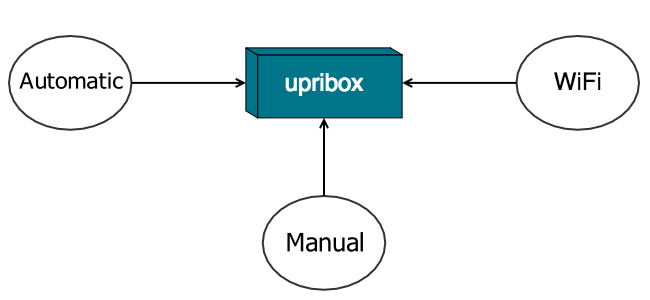

.. _integration:

######################
Integrate your upribox
######################

To integrate the upribox in your home network and access the web interface via the URI http://upri.box we implemented three different ways. This decision is motivated by the nature of these access modes. The most comfortable mode for the user, Apate, sometimes does not work with more complex home networks or specific routers we don't have control over. To give you an alternative your upribox can be accessed by configuring your upribox as the DHCP server on the network which requires a small configuration on your router at home. The third mode is to connect directly to the upribox WiFi and access the web interface from the connected device.

The easiest way to configure Apate or DHCP server mode is by using the WiFi mode and connecting a device to the upribox Siltent WiFi. You then can choose the mode that best fits your needs and expertise and change it whenever you like in the admin section of the upribox web interface.
In the following the three modes are described in more detail:

    The three different modes to access your upribox: Apate, DHCP server and WiFi

.. _apate:

*****
Apate
*****

After activating Apate you don't have to configure anything else. Ads and trackers on all your devices will be blocked.

Apate is an ARP spoofing daemon which means that the upribox will trick all devices on your network into thinking that it is the real recipient of the packets. Your phone, laptop or any other device then sends the traffic over the upribox, which acts as a Man-In-The-Middle and forwards the packets. Before returning requested websites to your device the upribox will always remove advertisements and trackers for you.
Some routers can detect ARP spoofing and treat it as an attack. In this case Apate won't work on your network. We therefore recommend to test Apate by activating it and trying to access the internet with another device (e.g. your smart phone).

***********
DHCP Server
***********

By setting up your upribox as the DHCP server of your network it will act as the distributor of IP addresses for all other devices. Additionally your upribox is again Man-In-The-Middle and can filter ads and trackers from your traffic.
To activate this mode you have to make some adjustments on your upribox and your router:

* The upribox needs a static IP address. This can be set in the admin section of the upribox web interface. Additionally you have to configure the subnet mask, the DNS server and the gateway. The form is going to be filled automatically and in most cases you can just accept the provided values.
* Activate the DHCP server mode in the admin section of the upribox web interface.
* Up to this point your home router had the role of the DHCP server. But now there's a new sheriff in town. Go to the web interface of your home router and deactivate the DHCP server.

*********
WiFi Mode
*********

If your router does not support Apate or you don't want to change any settings on your router you can still access your upribox web interface by connecting to one of the WiFis (Silent or Ninja). Please note that this way only devices directly connected to the WiFis will benefit from the upribox' ad-blocking mechanisms.

****************
What about IPv6?
****************

If you are using IPv6 on your home network we recommend using the WiFi mode or alternatively setting up an additional IPv4 only WiFi router which is connected to your upribox in Apate or DHCP server mode. To use the latter please don't forget to deactivate the DHCP server on the new router.
